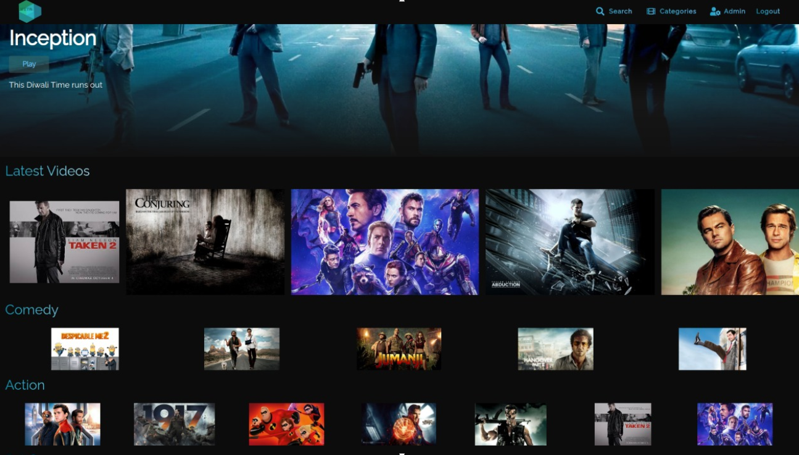
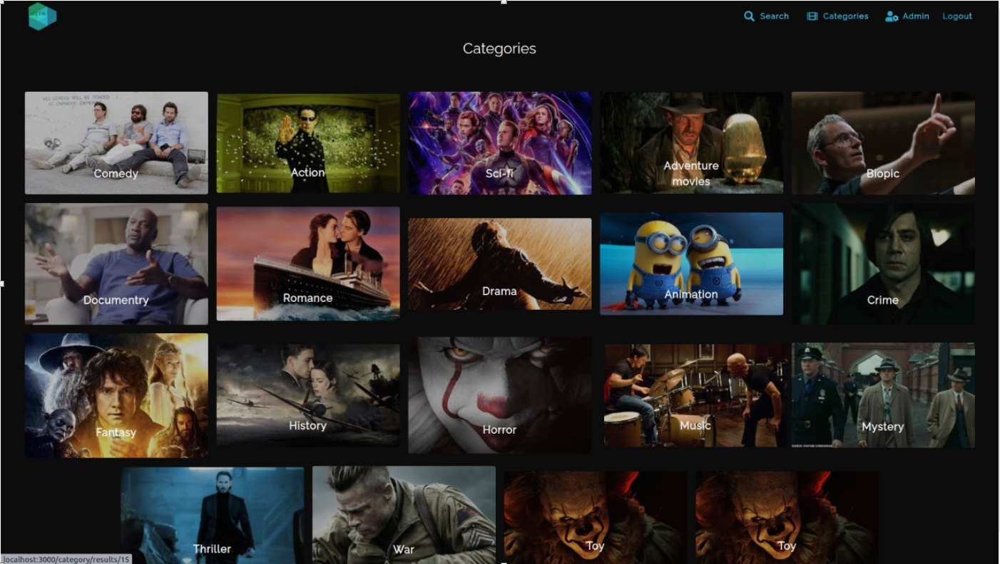
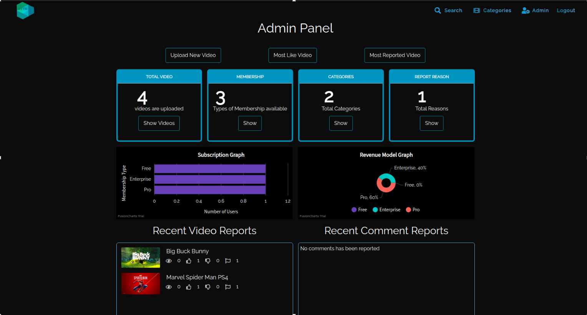
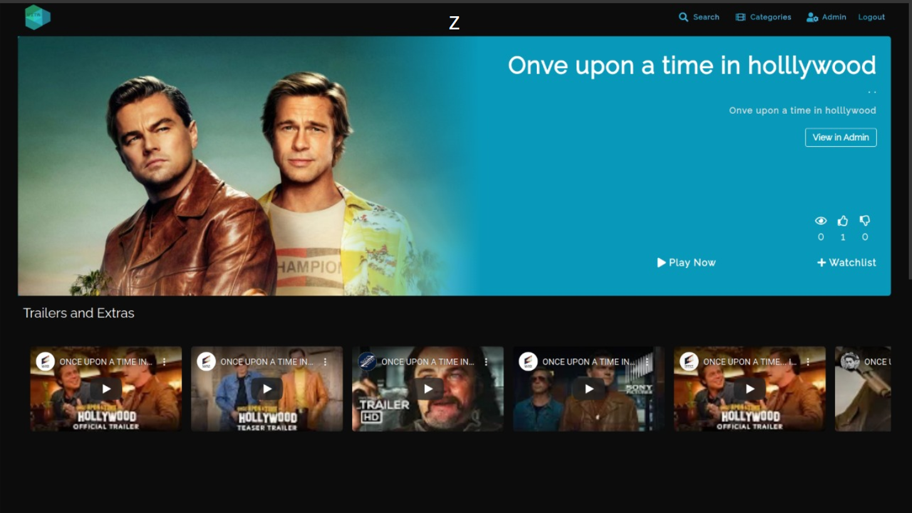
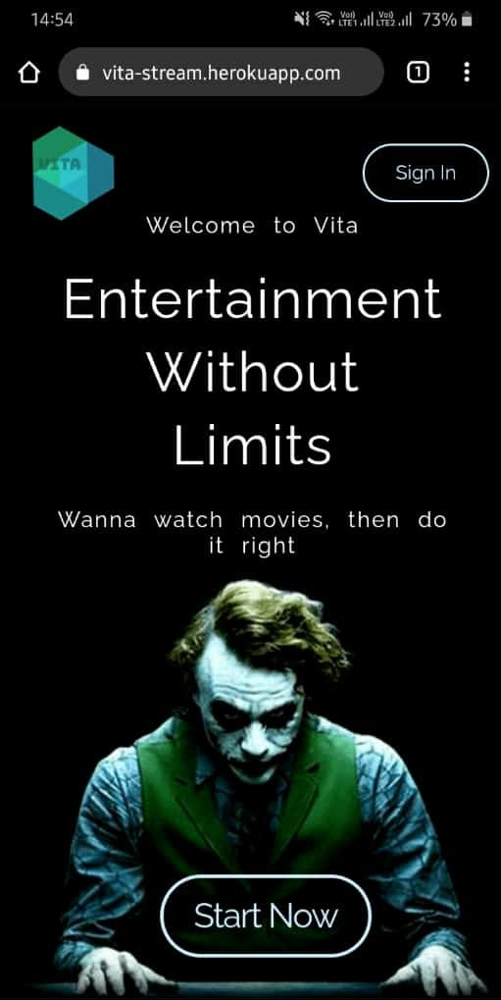
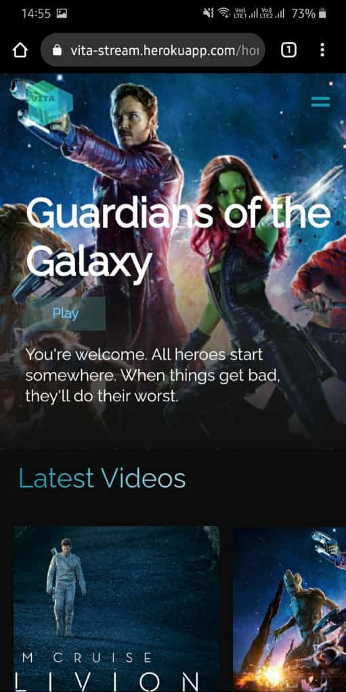
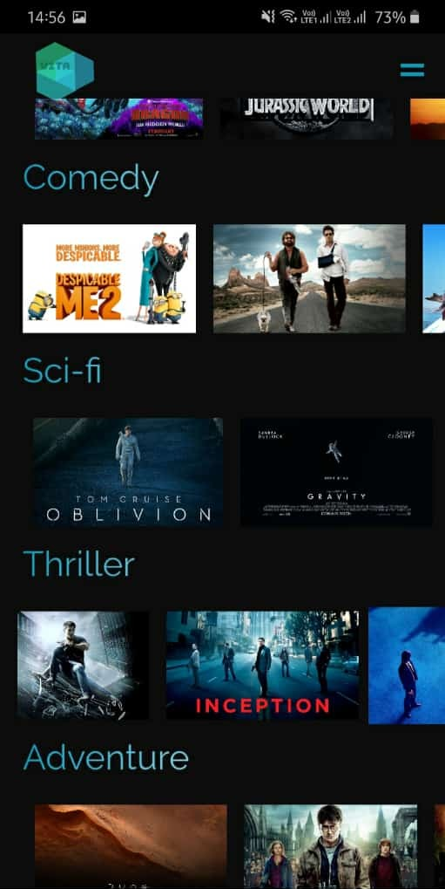
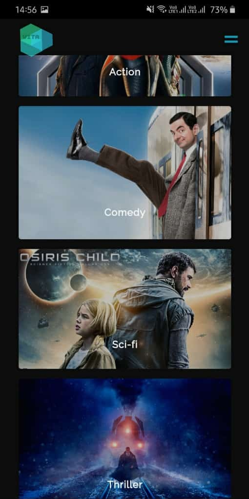
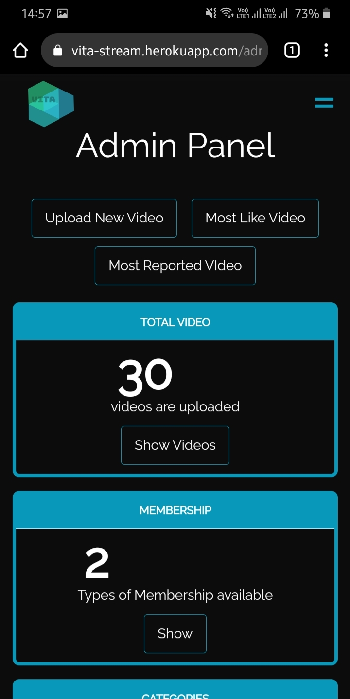

# Vita
Entertainment Without limits

### Website [Link](https://vita-stream.herokuapp.com/)

### Video [Link](https://drive.google.com/file/d/1quELmk67OJuVeHr1-x4shdxQJ8U5i-kK/view?usp=sharing)

### How to run locally?
* Clone the Repository.
* Make a virtual environment.
* Change directory to `vit-django/` to navigate to the backend directory.
* Run `pip install -r requirements.txt` to install the dependencies.
* Create `.env` file set following variables - 
  `SECRET_KEY, DEBUG, FB_SOCIAL_AUTH_KEY, FB_SOCIAL_SECRET, AWS_ACCESS_KEY_ID, AWS_SECRET_ACCESS_KEY, AWS_STORAGE_BUCKET_NAME, BRAINTREE_MERCHANT_ID, BRAINTREE_PUBLIC_KEY, BRAINTREE_PRIVATE_KEY, EMAIL_HOST_USER, EMAIL_HOST_PASSWORD` to able to access all the features like FB login, AWS S3 Bucket, Braintree Payment Gateway and Send Mail.
* Run `python manage.py makemigrations`.
* Run `python manage.py migrate`.
* Run `python manange.py runserver` to start the backend server.
* Change directory to `vitareact/` to navigate to the frontend directory.
* Create `.env`file set following variables - 
    * `REACT_APP_API=http://127.0.0.1:8000/api/`
    * `REACT_APP_FRONTEND=http://localhost:3000/`
    * `REACT_APP_BACKEND=http://localhost:8000`
    * `REACT_APP_FB_CLIENT_ID`
    * `REACT_APP_FB_CLIENT_SECRET`
    * `REACT_APP_FB_APP_ID` - FB login API
* Value of `REACT_APP_FB_CLIENT_ID`and `REACT_APP_FB_CLIENT_SECRET` you will get by making new entry in Applications Model in Django Admin (Client Type - Confidential, Authorization grant type - Resource owner password-based and User)
* Run `npm install` to install all the react dependencies.
* Run `npm start` to run the frontend server.
* Now you good to go.

### Features 
* More than just a movie streaming platform
* Customized HTML5 Video Player
* Like, Comment, Flag/Report Videos and Comments
* Create watchlists and add videos.
* Trailers and Extras from embedded from Youtube
* Access to paid plans by buying subscriptions.
* Fully responsive without any CSS framework
- Easy to use Admin Panel with full control of the platform.
* Graphs for Statistics of Users, Revenues & Videos
* Content reviewing and moderation by Admin.

### Tech Stack
* **Backend** - Django Rest Framework.
* **Frontend** - React.js.
* **Database** - postgresql.
* **Video Database** - AWS S3 Bucket.
* **Payment Gateway** - Braintree.

### Team : webPLASH
* [Aman Tibrewal](https://github.com/amantibrewal310)
* Harshit Gangwar

### A sneak peek

